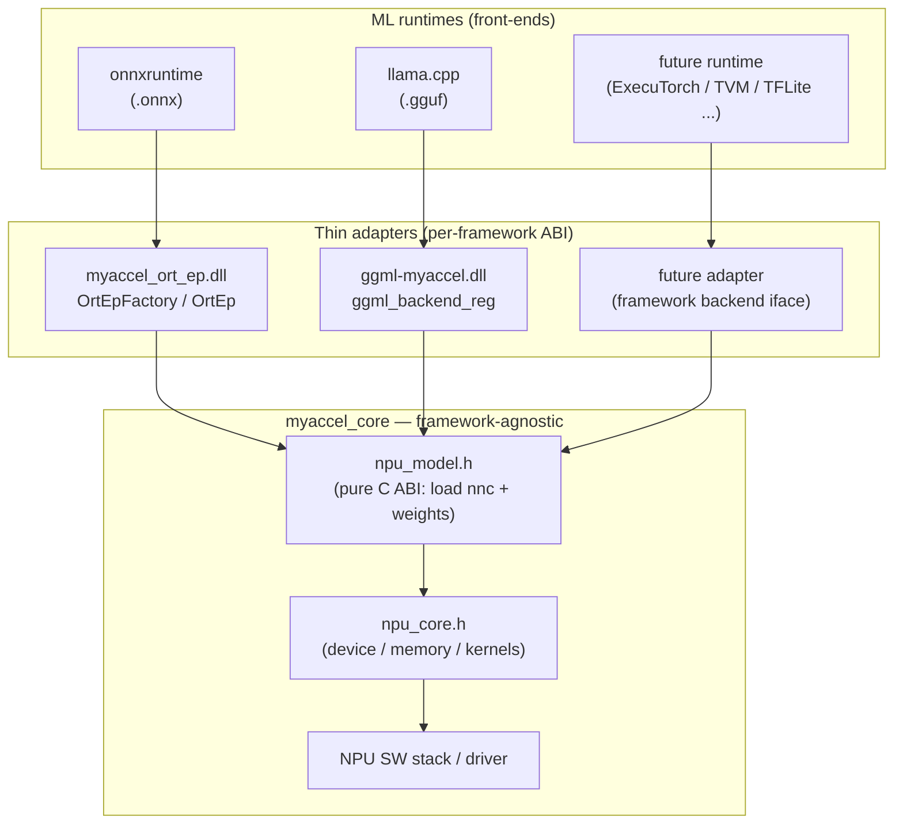
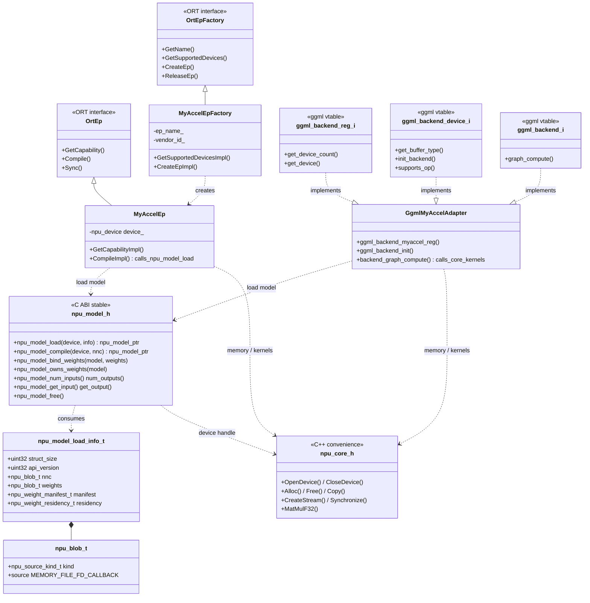
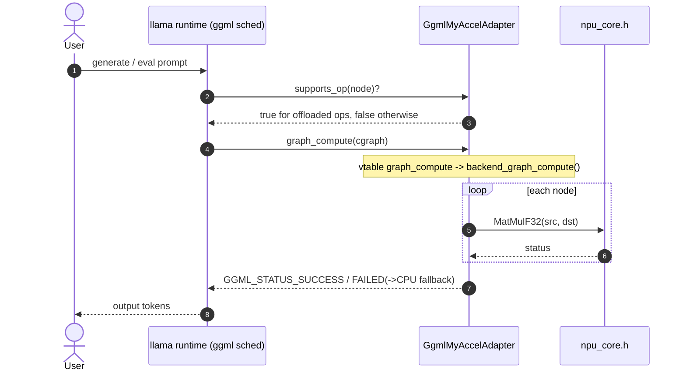
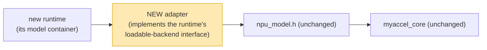

# Design — MyAccel shared NPU backend

A single in-house NPU software stack, reused unchanged by multiple ML runtimes.
This document describes the structure of `shared_backend/`, why it is shaped
this way, and — the headline property — **how cheaply a brand-new ML runtime can
be added** by writing one thin adapter and touching nothing else.

> Diagrams are [Mermaid](https://mermaid.js.org/); they render on GitHub.

---

## 1. Problem & approach

onnxruntime and llama.cpp have **completely different backend ABIs** (an
*Execution Provider* plugin vs. a *ggml-backend* registry). There is no single
interface to satisfy both. Naively, you would implement the NPU twice.

Instead we split responsibilities so the NPU is implemented **once**:



**Key boundary:** everything below `npu_model.h` / `npu_core.h` knows nothing
about `.onnx`, `.gguf`, `OrtEp`, or `ggml`. Each adapter converts its container
into the NPU's own `{model.nnc, weight.bin}` and calls the same C ABI.

---

## 2. Layered structure

| Layer | Module | Knows about | Stable? |
|---|---|---|---|
| Front-end | onnxruntime, llama.cpp, … | the model container (.onnx/.gguf) | n/a (external) |
| **Adapter** | `ort_ep/`, `ggml_backend/` | *one* framework ABI **and** the NPU C ABI | follows framework |
| **NPU model ABI** | `core/include/myaccel/npu_model.h` | `model.nnc` + `weight.bin` only | **pure C, versioned** |
| **NPU core** | `core/include/myaccel/npu_core.h` + impl | device/memory/kernels | C++ convenience |
| HW | NPU SW stack / driver | silicon | vendor |

The two core headers play different roles:
- `npu_model.h` — the **public, stable C ABI** every adapter calls (loading).
- `npu_core.h` — internal C++ convenience for device/memory/kernels used by the
  adapters and by the model-API implementation.

---

## 3. Class diagram



The adapters **inherit / implement their framework's interface** (left side) and
**depend on the same two core headers** (bottom). The core has zero edges back
up — a strict one-way dependency, which is what makes the core reusable.

---

## 4. Sequence diagrams

### 4.1 Loading a model — onnxruntime path

```mermaid
sequenceDiagram
    autonumber
    actor User
    participant ORT as onnxruntime
    participant Factory as MyAccelEpFactory
    participant EP as MyAccelEp
    participant NpuModel as npu_model.h
    participant NpuCore as npu_core.h

    User->>ORT: RegisterExecutionProviderLibrary("myaccel", dll)
    Note over Factory: DLL entry CreateEpFactories() constructs MyAccelEpFactory
    ORT->>Factory: GetSupportedDevicesImpl(hw_devices)
    Factory-->>ORT: OrtEpDevice (NPU matched by vendor id)
    User->>ORT: create session(model.onnx, EP=myaccel)
    ORT->>Factory: CreateEpImpl()
    Factory->>EP: new MyAccelEp(device)
    ORT->>EP: GetCapabilityImpl(graph)
    EP-->>ORT: fused nodes the NPU supports
    ORT->>EP: CompileImpl(fused subgraph)
    Note over EP: extract topology -> model.nnc<br/>gather initializers -> weight.bin
    EP->>NpuModel: npu_model_load(device, {nnc, weights, COPY_TO_DEVICE})
    NpuModel->>NpuCore: OpenDevice(); Alloc(); Copy() weights
    NpuCore-->>NpuModel: ok
    NpuModel-->>EP: npu_model*
    EP-->>ORT: OrtNodeComputeInfo (holds npu_model*)
    ORT-->>User: session ready
```

### 4.2 Loading a model — llama.cpp path (zero-copy weights)

```mermaid
sequenceDiagram
    autonumber
    actor User
    participant GGML as llama runtime (ggml)
    participant AD as GgmlMyAccelAdapter
    participant NpuModel as npu_model.h
    participant NpuCore as npu_core.h

    User->>GGML: llama-cli ... (GGML_BACKEND_PATH=ggml-myaccel.dll)
    GGML->>AD: ggml_backend_init()
    AD-->>GGML: ggml_backend_reg (api_version checked)
    User->>GGML: load model.gguf, select "myaccel_npu"
    GGML->>AD: get_device_count() / get_device()
    GGML->>AD: init_backend()
    Note over AD: gguf is mmap'd; extract nnc + weights (no copy)
    AD->>NpuModel: npu_model_load(device, {nnc, weights=mmap_ptr, REFERENCE_HOST})
    NpuModel->>NpuCore: OpenDevice(); reference host weights
    NpuCore-->>NpuModel: ok
    NpuModel-->>AD: npu_model*
    AD->>NpuModel: npu_model_owns_weights() -> 0
    Note over AD: gguf mapping MUST stay alive for model lifetime
    AD-->>GGML: backend ready
    GGML-->>User: model loaded
```

Same `npu_model_load`, two different weight-delivery strategies — absorbed by
`npu_blob_t` + `residency`. That is the shared boundary doing its job.

### 4.3 Inference dispatch (ggml)



---

## 5. Why this structure wins

1. **Implement the NPU once.** Device discovery, allocation, DMA, kernels, model
   loading live solely in `myaccel_core` + `npu_model.h`. Adapters add no NPU
   logic — they only translate ABIs.
2. **Framework churn is contained.** When onnxruntime bumps its EP API or ggml
   reorders a vtable, only the *one* affected adapter changes. The core and the
   other adapter are untouched.
3. **Stable, language-neutral contract.** `npu_model.h` is pure C with
   `struct_size`/`api_version` guards and opaque handles. A host built against
   an older header still loads; any language with a C FFI can bind it.
4. **No host rebuild.** ORT loads the adapter as an external plugin EP; llama.cpp
   loads a DLL at runtime. Shipping a new NPU build = shipping a DLL.
5. **Independently testable.** A mock core lets adapters be tested with no
   hardware, and a three-way *parity* harness proves every front-end produces
   the same numbers from the same weights (see `test_plan.md`).
6. **Clear ownership boundary.** `residency` + `npu_model_owns_weights()` make
   the copy-vs-zero-copy contract explicit, so each runtime uses its natural
   weight storage (ORT in-memory, gguf mmap) without the core caring.

---

## 6. Porting a NEW ML runtime (the main payoff)

Adding a runtime is **one new adapter** in its own folder. You write only the
shaded box; everything below `npu_model.h` is reused verbatim.



Every adapter follows the **same 5-step contract**, regardless of framework:

| Step | What the adapter does | Calls into |
|---|---|---|
| 1. Advertise | Report the NPU as a device in the framework's registry | framework iface |
| 2. Convert | Extract/convert the runtime's model → `model.nnc` + `weight.bin` | adapter-local |
| 3. Load | Fill `npu_model_load_info_t`, choose source kind + residency | `npu_model_load` |
| 4. Bind I/O | Map framework tensors to `npu_model_get_input/output` | `npu_model.h` |
| 5. Dispatch | On each run, feed activations, run, read outputs | `npu_core.h` |

Concretely, the extension point in each ecosystem:

| Runtime | Loadable-backend extension point | Adapter status |
|---|---|---|
| **onnxruntime** | plugin Execution Provider (`OrtEpFactory`/`OrtEp`) | ✅ `ort_ep/` |
| **llama.cpp** | ggml-backend registry (`ggml_backend_reg`) | ✅ `ggml_backend/` |
| ExecuTorch | `BackendInterface` delegate (`init`/`execute`/`destroy`) | recipe above |
| Apache TVM | BYOC + runtime `Module` | recipe above |
| TFLite | `TfLiteDelegate` | recipe above |
| OpenVINO | plugin / remote context | recipe above |
| TensorRT / Triton | custom backend | recipe above |

Because the per-framework code is *thin* (the ORT adapter is ~3 small files; the
ggml adapter is one file of vtable wiring), porting is measured in days, not a
backend rewrite — and the new runtime instantly inherits the existing kernels,
memory management, weight-delivery options, and parity test harness.

---

## 7. Module map

```
shared_backend/
├─ core/
│  ├─ include/myaccel/npu_core.h    device / memory / kernels (C++)
│  ├─ include/myaccel/npu_model.h   model-loading C ABI  (stable boundary)
│  └─ src/                          reference / stub impl
├─ ort_ep/                          onnxruntime adapter  (-> myaccel_ort_ep.dll)
├─ ggml_backend/                    llama.cpp adapter    (-> ggml-myaccel.dll)
└─ docs/
   ├─ design.md        (this file)
   ├─ npu_model_api.md (API usage per runtime)
   └─ test_plan.md     (verification strategy)
```

See `npu_model_api.md` for per-runtime call examples and `test_plan.md` for how
the parity guarantee is verified.
