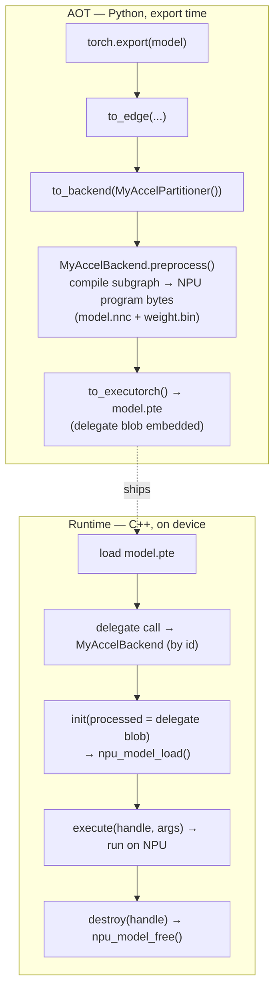

# Using the MyAccel NPU backend from ExecuTorch

How to run models on the in-house NPU through ExecuTorch's **delegate /
backend** mechanism. The adapter lives in `shared_backend/executorch/` and
builds to `myaccel_backend.dll` / `libmyaccel_backend.so`, which references the
same `myaccel_core` as the onnxruntime EP and llama.cpp ggml adapters.

> Diagrams are Mermaid (render on GitHub). PlantUML versions:
> [`executorch_integration.puml`](executorch_integration.puml).

ExecuTorch integration has **two halves** that must agree on one backend id
string, `"MyAccelBackend"`:

- **AOT (ahead-of-time, Python)** — at export time a *partitioner* tags
  NPU-friendly subgraphs and the backend's `preprocess()` compiles them into a
  bytes blob (the NPU program = `model.nnc` + `weight.bin`). That blob is
  embedded in the `.pte` as a delegate payload.
- **Runtime (C++, on device)** — the registered `MyAccelBackend`
  (`BackendInterface`) receives that blob in `init()` and runs it via the NPU.



---

## 0. How ExecuTorch delegation works

The runtime side is a `BackendInterface` with four methods, registered by name:

```cpp
class MyAccelBackend final : public executorch::runtime::BackendInterface {
  bool is_available() const override;
  Result<DelegateHandle*> init(BackendInitContext&, FreeableBuffer* processed,
                               ArrayRef<CompileSpec>) const override;  // load delegate blob
  Error execute(BackendExecutionContext&, DelegateHandle*, EValue** args) const override;
  void destroy(DelegateHandle*) const override;
};
// register_backend({"MyAccelBackend", &instance});  // id MUST match the AOT backend
```

- `processed` in `init()` is exactly the bytes your AOT `preprocess()` produced —
  the NPU-native program. We hand it to `npu_model_load()`.
- The returned `DelegateHandle*` (we store an `npu_model_t*`) is passed back to
  `execute()` and `destroy()`.

> Version note: ExecuTorch has moved its symbols across releases
> (`torch::executor` → `executorch::runtime`) and header paths change. The
> adapter is written against `executorch::runtime`; confirm against your
> checkout (`executorch/runtime/backend/interface.h`).

---

## 1. Runtime: register and run `myaccel_backend`

The backend must be **registered before loading a `.pte`** that delegates to it.
Two ways:

1. **Static init on load.** `myaccel_backend.cpp` has a file-scope
   `register_backend("MyAccelBackend", …)` that runs when the library is loaded
   (process start for a linked DLL, or `dlopen`/`LoadLibrary`).
   - If you **statically** link `myaccel_backend` into your executor, pass
     `--whole-archive` (GCC/Clang) / `/WHOLEARCHIVE` (MSVC) so the registration
     object is not dropped by the linker.
2. **Explicit registration.** Call the exported entry after loading the DLL:
   ```c
   // exported from myaccel_backend.dll
   int myaccel_backend_register(void);
   ```

Then load and run as usual (e.g. via `executorch::extension::Module`):

```cpp
executorch::extension::Module module("model.pte");
auto outputs = module.forward(inputs);  // NPU subgraphs run on MyAccelBackend
```

### Runtime lifecycle

```mermaid
sequenceDiagram
    autonumber
    actor User
    participant APP as host app
    participant ETRT as executorch runtime
    participant ETB as myaccel_backend (MyAccelBackend)
    participant API as npu_model.h / myaccel::npu
    participant CORE as myaccel_core

    Note over ETB: load → static init OR myaccel_backend_register()<br/>register_backend("MyAccelBackend")
    User->>APP: run inference(model.pte, inputs)
    APP->>ETRT: load Program(model.pte)
    ETRT->>ETB: init(ctx, processed = delegate blob, compile_specs)
    ETB->>API: npu_model_load(device, {nnc+weights from blob, COPY_TO_DEVICE})
    API->>CORE: compile + bind weights
    CORE-->>API: npu_model*
    API-->>ETB: npu_model*
    ETB-->>ETRT: DelegateHandle* (holds npu_model*)
    User->>APP: forward(inputs)
    APP->>ETRT: execute
    ETRT->>ETB: execute(ctx, handle, EValue** args)
    ETB->>API: bind I/O (npu_model_get_input/output) ; run
    API->>CORE: dispatch kernels
    CORE-->>API: outputs
    API-->>ETB: ok
    ETB-->>ETRT: Error::Ok
    ETRT-->>APP: outputs
    APP-->>User: results
    Note over ETRT,ETB: session end
    ETRT->>ETB: destroy(handle)
    ETB->>API: npu_model_free()
```

---

## 2. AOT: partition + preprocess (Python, export time)

At export you need a **partitioner** (which nodes go to the NPU) and a
**backend** (`preprocess` that compiles them). Sketch:

```python
from executorch.exir.backend.backend_details import BackendDetails, PreprocessResult
from executorch.exir.backend.partitioner import Partitioner, PartitionResult
from executorch.exir.backend.compile_spec_schema import CompileSpec

BACKEND_ID = "MyAccelBackend"   # MUST equal the C++ register_backend id

class MyAccelBackend(BackendDetails):
    @staticmethod
    def preprocess(edge_program, compile_specs: list[CompileSpec]) -> PreprocessResult:
        # Lower the tagged subgraph to the NPU program (model.nnc + weight.bin)
        # using your NPU compiler, then return the bytes that init() will receive.
        blob: bytes = my_npu_compiler.compile(edge_program, compile_specs)
        return PreprocessResult(processed_bytes=blob)

class MyAccelPartitioner(Partitioner):
    def partition(self, edge_program) -> PartitionResult:
        # tag NPU-supported nodes with DelegationSpec(BACKEND_ID, compile_specs)
        ...
```

Export and emit the `.pte`:

```python
import torch
from executorch.exir import to_edge

edge = to_edge(torch.export.export(model, example_inputs))
lowered = edge.to_backend(MyAccelPartitioner())     # runs preprocess() per subgraph
prog = lowered.to_executorch()                       # embeds the delegate blob
open("model.pte", "wb").write(prog.buffer)
```

The blob from `preprocess()` is byte-for-byte what the C++ `init()` receives as
`processed`.

---

## 3. Linking & deployment

`myaccel_backend` **references `myaccel_core`** (it calls `myaccel::npu::*` and
the `npu_model` C ABI), and links the ExecuTorch runtime.

```cmake
target_link_libraries(myaccel_backend PRIVATE myaccel_core)   # NPU core
# + the ExecuTorch runtime/backend-interface library (EXECUTORCH_DIR)
```

Build (opt-in):

```bash
cmake -S shared_backend -B build \
      -DMYACCEL_BUILD_EXECUTORCH=ON -DEXECUTORCH_DIR=/path/to/executorch \
      -DMYACCEL_CORE_SHARED=ON
cmake --build build --config Release
# -> myaccel_backend.{dll,so}  (imports myaccel_core when MYACCEL_CORE_SHARED=ON)
```

Deployment (when the core is a separate DLL): co-locate `myaccel_core.dll` (and
any NPU stack DLLs) next to `myaccel_backend.dll` / the executor — the adapter
imports the core at load time. See the combined picture
`linking_overview_all` in [`llama_integration.puml`](llama_integration.puml) /
the "All three runtimes" section of [`llama_integration.md`](llama_integration.md).

---

## 4. What is implemented vs. TODO

- ✅ `BackendInterface` skeleton (`is_available`/`init`/`execute`/`destroy`),
  static + explicit registration, `init()` loads the delegate blob via
  `npu_model_load`.
- 🔧 `execute()` — still needs `EValue` tensor ↔ NPU I/O binding
  (`npu_model_get_input/output`, copy/run) and output write-back.
- 🔧 Real `npu_device_t` wiring (the stub `npu_model_load` ignores the device).
- 🔧 The Python AOT side (`preprocess`/`Partitioner`) is a sketch — wire it to
  your NPU compiler and keep `BACKEND_ID` in sync with the C++ `register_backend`
  id.
- 🔧 Confirm the ExecuTorch namespace/headers (`executorch::runtime`) and
  library names against your ExecuTorch version.
