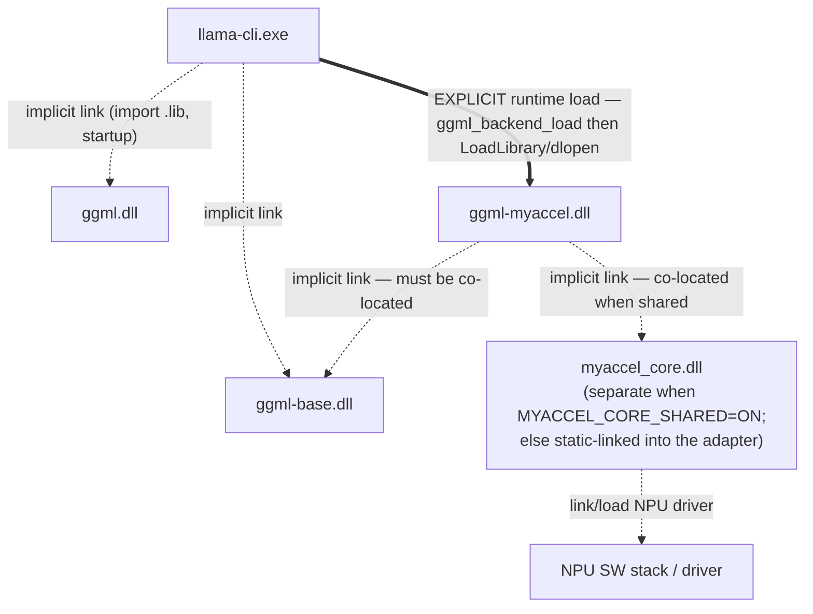
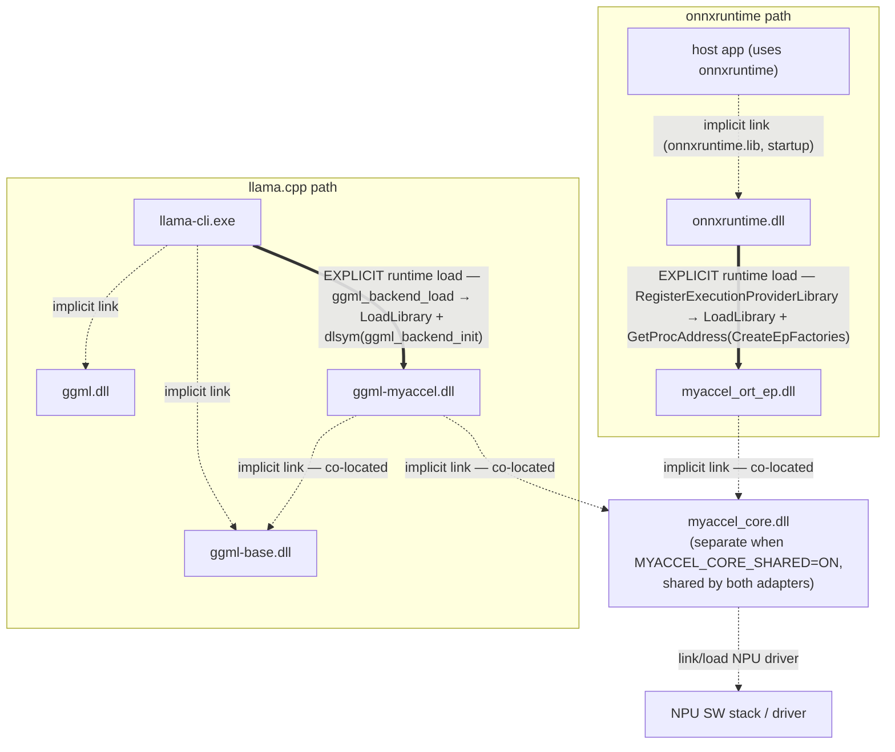
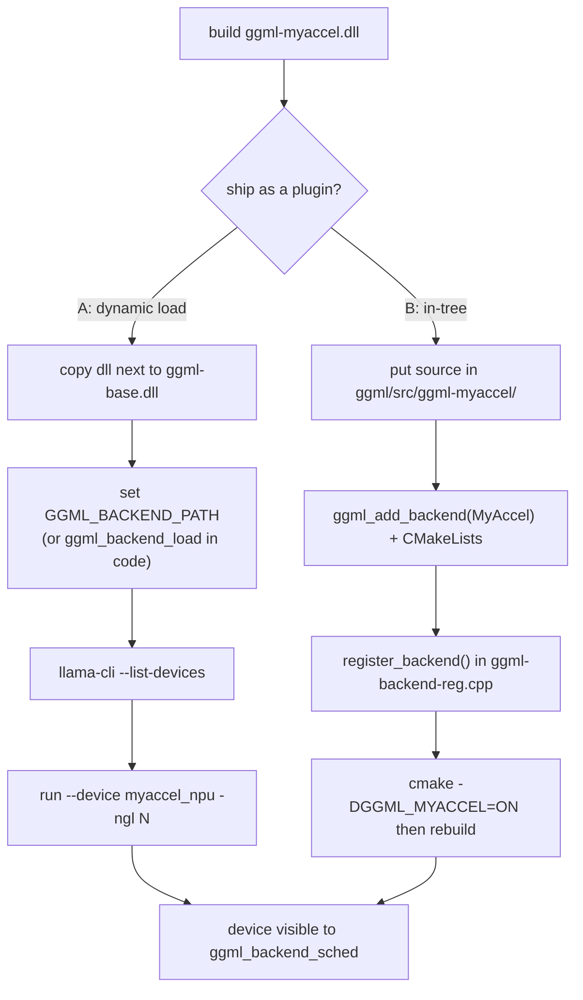

# Using `ggml-myaccel.dll` from llama.cpp

How to consume the MyAccel NPU backend from llama.cpp, two ways:

- **(A) Dynamic loading** — ship the prebuilt `ggml-myaccel.dll` and have
  llama.cpp load it at runtime. Recommended.
- **(B) In-tree** — compile the backend into the ggml source tree as a
  first-class backend (e.g. `llama.cpp/ggml/src/ggml-myaccel/`).

It closes with a clarification about `llama.cpp/src/models/my_npu.cpp`, which is
a common point of confusion.

---

## 0. How ggml loads a dynamic backend (the key mechanism)

llama.cpp (ggml) opens a shared library with `ggml_backend_load(path)` and looks
up exactly **one symbol, `ggml_backend_init`** (`ggml/src/ggml-backend-reg.cpp`):

```c
typedef ggml_backend_reg_t (*ggml_backend_init_t)(void);
// dlsym / GetProcAddress("ggml_backend_init") -> call -> register the reg
// if reg->api_version != GGML_BACKEND_API_VERSION the backend is rejected
```

`ggml-myaccel.dll` already exports `ggml_backend_init` (and
`ggml_backend_myaccel_reg`) and fills `api_version = GGML_BACKEND_API_VERSION`,
so it is load-compatible — **provided the ggml version it was built against
matches the ggml version inside llama-cli** (otherwise `api_version` differs and
the load is refused).

---

## Linking the executable to the DLL

A program reaches a DLL in one of two ways — and ggml uses **both**, for
different libraries:

| | Implicit (load-time / static) linking | Explicit (run-time) loading |
|---|---|---|
| Resolved | at **build**, loaded by the OS at process **startup** | program calls `LoadLibrary` / `dlopen` at **runtime** |
| Needs | the import library (`.lib` on Windows / the `.so`) at link time | nothing at build; just the path at runtime |
| If missing | the exe **fails to start** | handled gracefully (returns null) |
| Used by | `llama-cli.exe` → `ggml-base.dll`; `ggml-myaccel.dll` → `ggml-base.dll` | `llama-cli` → `ggml-myaccel.dll` (a backend) |

Consequences for this backend:

- **The executable does NOT link `ggml-myaccel.dll`.** ggml backends are loaded
  explicitly at runtime via `ggml_backend_load`, so the backend never appears in
  llama-cli's linker inputs. A new NPU build = drop in a DLL, no host rebuild.
- **`ggml-myaccel.dll` *does* implicitly link `ggml-base.dll`** (the adapter
  calls `ggml_backend_*`). The OS resolves that dependency when it loads our DLL,
  which is why `ggml-base.dll` **must be co-located** (same folder or on `PATH`).
- **`myaccel_core`** is, by default, a static `.lib` compiled into each adapter
  (no separate DLL). Configure with **`-DMYACCEL_CORE_SHARED=ON`** to build it as
  its own **`myaccel_core.dll`** that both adapters implicitly link; then
  `myaccel_core.dll` must be **co-located** with the adapter DLLs.

Implicit linking in CMake (the `ggml-myaccel → ggml-base` / `→ myaccel_core` edges):

```cmake
target_link_libraries(ggml-myaccel PRIVATE ggml-base)        # in-tree target, or
target_link_libraries(ggml-myaccel PRIVATE "C:/.../ggml-base.lib")
target_link_libraries(ggml-myaccel PRIVATE myaccel_core)     # static or import lib
```



### Both runtimes together (onnxruntime + llama.cpp)

The same picture extended to the onnxruntime path. The symmetry is the point:
**neither adapter links its framework** — each is loaded at runtime through a
single entry symbol (`CreateEpFactories` for ORT, `ggml_backend_init` for ggml)
— and **both adapters share one `myaccel_core.dll`**.



> The onnxruntime EP plugin does **not** link `onnxruntime.dll`; it uses the
> `OrtApi` passed into `CreateEpFactories`. See `npu_model_api.md` /
> `design.md` for the ORT-side details.

### Building the core as a separate DLL

```bat
cmake -S shared_backend -B build -DMYACCEL_CORE_SHARED=ON ^
      -DORT_HOME=C:\ort -DLLAMA_CPP_DIR=C:\llama.cpp
cmake --build build --config Release
```

Produces `myaccel_core.dll` (+ `myaccel_core.lib` import) alongside
`ggml-myaccel.dll` and `myaccel_ort_ep.dll`. At runtime put `myaccel_core.dll`
next to the adapter DLLs (and the host exe). Verified on Linux: the adapter's
`NEEDED`/import table references `myaccel_core`, the core exports
`npu_model_load` / `myaccel::*`, and the adapter still exports only its plugin
entry points.

## Inside `ggml_backend_load_all()`

`ggml_backend_load_all()` (called by llama-cli at startup) does two things:

1. tries each **built-in** backend name (cuda, vulkan, cpu, ...) by searching for
   `*ggml-<name>.*` and loading the best — this list does **not** include
   "myaccel";
2. reads the `GGML_BACKEND_PATH` environment variable and loads that library
   directly via `ggml_backend_load(path)`.

`ggml_backend_load(path)` then:

1. `dl_load_library(path)` → `LoadLibraryW` / `dlopen` (the OS also resolves
   dependent DLLs such as `ggml-base.dll`);
2. `dl_get_sym("ggml_backend_init")` → `GetProcAddress` / `dlsym`;
3. calls `ggml_backend_init()` → obtains the `ggml_backend_reg`;
4. verifies `reg.api_version == GGML_BACKEND_API_VERSION` (rejects on mismatch);
5. `register_backend(reg)` → the device joins the global registry and appears in
   `ggml_backend_dev_count()` / `--list-devices`.

```mermaid
sequenceDiagram
    autonumber
    actor User
    participant APP as llama-cli (main)
    participant LOADALL as ggml_backend_load_all()
    participant OS as OS loader
    participant DLL as ggml-myaccel.dll
    participant REG as ggml registry

    User->>APP: set GGML_BACKEND_PATH=...; run llama-cli
    APP->>LOADALL: ggml_backend_load_all()
    LOADALL->>LOADALL: scan built-in names + read GGML_BACKEND_PATH
    LOADALL->>OS: ggml_backend_load(path) then dl_load_library
    Note over OS: LoadLibraryW / dlopen<br/>resolves dependent ggml-base.dll
    OS-->>LOADALL: module handle
    LOADALL->>OS: dl_get_sym("ggml_backend_init")
    OS-->>LOADALL: function pointer
    LOADALL->>DLL: ggml_backend_init()
    DLL-->>LOADALL: ggml_backend_reg
    LOADALL->>LOADALL: verify api_version == GGML_BACKEND_API_VERSION
    LOADALL->>REG: register_backend(reg) (adds devices)
    REG-->>LOADALL: ok
    LOADALL-->>APP: done
    APP->>REG: ggml_backend_dev_by_name("myaccel_npu")
    REG-->>APP: device handle
    APP-->>User: --list-devices shows myaccel_npu
```

## Choosing A (dynamic) vs B (in-tree)



> PlantUML versions of every diagram on this page:
> [`llama_integration.puml`](llama_integration.puml).

---

## A. Use the prebuilt DLL via dynamic loading (recommended)

### A-1. Place runtime dependencies side by side

`ggml-myaccel.dll` imports `ggml-base.dll`. Windows resolves that import from the
same directory or from `PATH` at load time. Put all of them together:

```
<llama run dir>\
   llama-cli.exe
   ggml-base.dll        (already shipped with llama)
   ggml-myaccel.dll     <- copy here
   <your NPU stack DLLs> (once the core links a real SDK)
```

### A-2. Make llama.cpp load the DLL — two methods

**(1) `GGML_BACKEND_PATH` environment variable — no code changes, simplest.**
llama-cli calls `ggml_backend_load_all()` at startup, which loads the library
pointed to by `GGML_BACKEND_PATH`:

```bat
set GGML_BACKEND_PATH=C:\...\shared_backend\build\ggml_backend\Debug\ggml-myaccel.dll
llama-cli --list-devices
```

> Note: `ggml_backend_load_all()` only auto-scans the *built-in* backend names
> (cuda/vulkan/cpu/...). It does not know the name "myaccel", so explicit
> loading via this env var (or method 2) is what reliably registers it.

**(2) Explicit load in code** — when you integrate directly:

```c
#include "ggml-backend.h"
ggml_backend_reg_t reg = ggml_backend_load("C:/.../ggml-myaccel.dll");
if (!reg) {
    // load failed: check path, missing dependent DLLs, or api_version mismatch
}
```

After a successful load the reg auto-registers, and the device is visible via
`ggml_backend_dev_count()` / `ggml_backend_dev_by_name("myaccel_npu")`.

### A-3. Verify the load

```bat
llama-cli --list-devices
```

The MyAccel device (`myaccel_npu`, type GPU) should appear. If it does not:

- `ggml-base.dll` is not next to the DLL (dependency resolution failed) — most
  common cause.
- `api_version` mismatch (the DLL was built against a different ggml version).
- `GGML_BACKEND_PATH` is wrong / mistyped.

### A-4. Run inference on the device

The device reports `GGML_BACKEND_DEVICE_TYPE_GPU`, so it is an offload target:

```bat
llama-cli -m model.gguf --device myaccel_npu -ngl 99 -p "Hello"
```

- `--device myaccel_npu` — use this device
- `-ngl N` — offload N layers to GPU-type devices

> ⚠️ **Important limitation.** The current scaffold returns `true` from
> `device_supports_op` only for `MUL_MAT`. The ggml scheduler
> (`ggml_backend_sched`) places **only the ops a backend claims** on that device
> and falls everything else back to the CPU. So with `-ngl` today, most ops run
> on the CPU and each one incurs a device↔host copy — often **slower** than pure
> CPU. To get real acceleration, add the ops the model uses (RMS_NORM, ROPE,
> SOFT_MAX, ADD, MUL, attention, ...) to `device_supports_op` *and* implement
> their kernels in `backend_graph_compute`.

---

## B. Integrate in-tree as a ggml backend (`llama.cpp/ggml/...`)

Instead of loading a DLL, compile the backend into ggml as a first-class
backend, the same way `ggml-cuda` / `ggml-vulkan` are built. This is the
`llama.cpp/ggml/src/ggml-myaccel/` path.

### B-1. Source layout

```
llama.cpp/ggml/src/ggml-myaccel/
   ggml-myaccel.cpp        <- the adapter from shared_backend
   CMakeLists.txt
```

ggml's backend directory convention is `ggml/src/ggml-<name>/`.

### B-2. Register with ggml's CMake

ggml gates each backend behind `ggml_add_backend(<Name>)`. In
`ggml/src/CMakeLists.txt`, next to the other backends:

```cmake
ggml_add_backend(MyAccel)
```

and `ggml/src/ggml-myaccel/CMakeLists.txt`:

```cmake
ggml_add_backend_library(ggml-myaccel ggml-myaccel.cpp)
# link the NPU core
# target_link_libraries(ggml-myaccel PRIVATE myaccel_core)
```

Enable it at configure time:

```bat
cmake -S llama.cpp -B build -DGGML_MYACCEL=ON
```

### B-3. Static registration (no DLL load)

In-tree backends are registered at compile time in
`ggml/src/ggml-backend-reg.cpp`, inside the registry constructor:

```cpp
#ifdef GGML_USE_MYACCEL
    register_backend(ggml_backend_myaccel_reg());
#endif
```

Now no `GGML_BACKEND_PATH` and no `ggml_backend_load` are needed — the device is
present as soon as llama starts.

### A vs B — which to choose

- **Dynamic DLL (A)** is usually better: no host rebuild, easy to ship/swap, the
  same philosophy as the onnxruntime plugin EP.
- **In-tree (B)** when you want to upstream into ggml or unify the build.

---

## C. About `llama.cpp/src/models/my_npu.cpp` (clearing up a misconception)

There is a likely design misconception worth stating plainly:

**`src/models/*.cpp` are model-architecture graph builders, not the place where
a backend is selected.** Recent llama.cpp split graph construction out of
`llama-model.cpp` into per-architecture files `src/models/<arch>.cpp` (llama,
qwen, phi, ...). These files are **backend-agnostic** — they only build a
`ggml_cgraph` (the op graph).

**Which device runs that graph is not decided by the model file.**
`ggml_backend_sched` (the scheduler) does it:

1. it looks at the registered devices,
2. for each op it asks `device_supports_op()` — "can this backend run this op?",
3. it places supported ops on that device (the NPU) and the rest on the CPU.

So to run on the NPU you do **not** put backend code in `my_npu.cpp`. You
register the backend (via A or B) and fill in `supports_op`; the *existing*
model graph is then offloaded to the NPU automatically.

```mermaid
sequenceDiagram
    autonumber
    participant MODEL as src/models/arch.cpp (graph builder)
    participant SCHED as ggml_backend_sched
    participant AD as GgmlMyAccelAdapter
    participant CPU as CPU backend

    MODEL->>SCHED: build op graph (no backend chosen)
    loop each node
        SCHED->>AD: supports_op(node)?
        alt op supported
            AD-->>SCHED: true → place on NPU
        else not supported
            AD-->>SCHED: false
            SCHED->>CPU: place on CPU (fallback)
        end
    end
    Note over MODEL: To run on the NPU you do NOT edit my_npu.cpp;<br/>register the backend + fill supports_op.
```

`src/models/my_npu.cpp` is only meaningful in one of these cases:

- You are adding a **new model architecture** → write its graph builder in
  `my_npu.cpp` and register it in the `llama_arch` enum / `llm_load_hparams` /
  graph dispatch. (This is a model-structure addition, *separate* from the NPU
  backend work.)
- You simply want to **run a model on the NPU** → `my_npu.cpp` is **not needed**.
  Attach the backend with A or B and run with `--device myaccel_npu -ngl N`.

---

## Summary

| Goal | How |
|---|---|
| Try the built DLL immediately | **A** — copy next to `ggml-base.dll`, set `GGML_BACKEND_PATH`, verify with `llama-cli --list-devices`, run `--device myaccel_npu -ngl N` |
| Bake it into ggml | **B** — `ggml/src/ggml-myaccel/` + `ggml_add_backend(MyAccel)` + static `register_backend` in reg.cpp |
| Real acceleration | implement `supports_op` + `backend_graph_compute` for the model's op set (only `MUL_MAT` today → mostly CPU fallback) |
| `src/models/my_npu.cpp` | unrelated to backend selection; needed only when adding a new **model architecture** |
